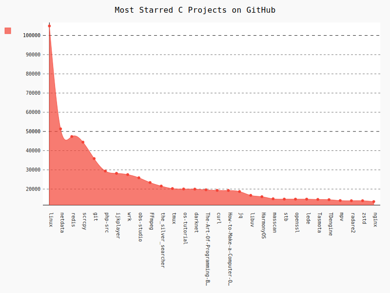
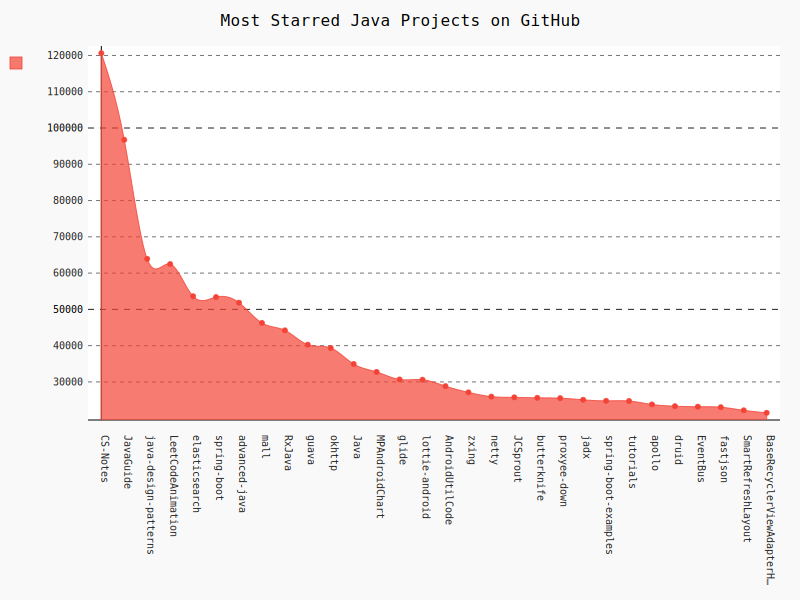
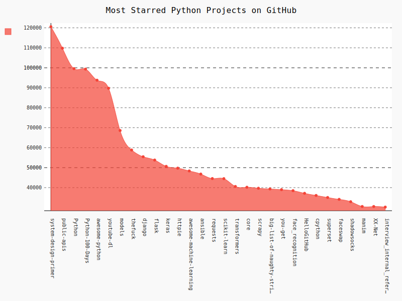
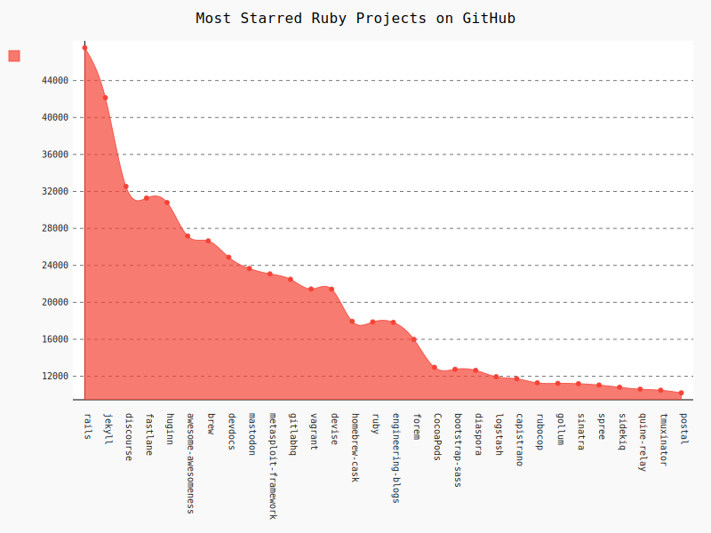
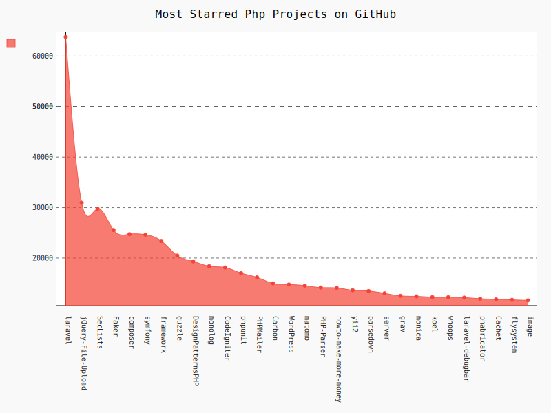
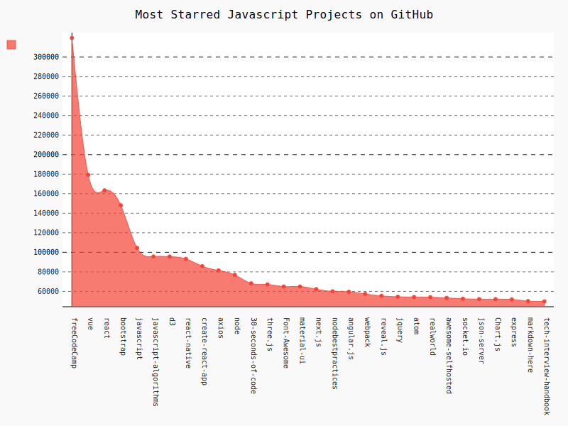

# Top-Repo-Visualizer
## Program to generate visual graph of top most starred GitHub repos.

### Screenshots
<h4> Most Starred C repos </h4>

<h4> Most Starred Java repos </h4>

<h4> Most Starred Python repos </h4>

<h4> Most Starred Ruby repos </h4>

<h4> Most Starred php repos </h4>

<h4> Most Starred JavaScript repos </h4>

